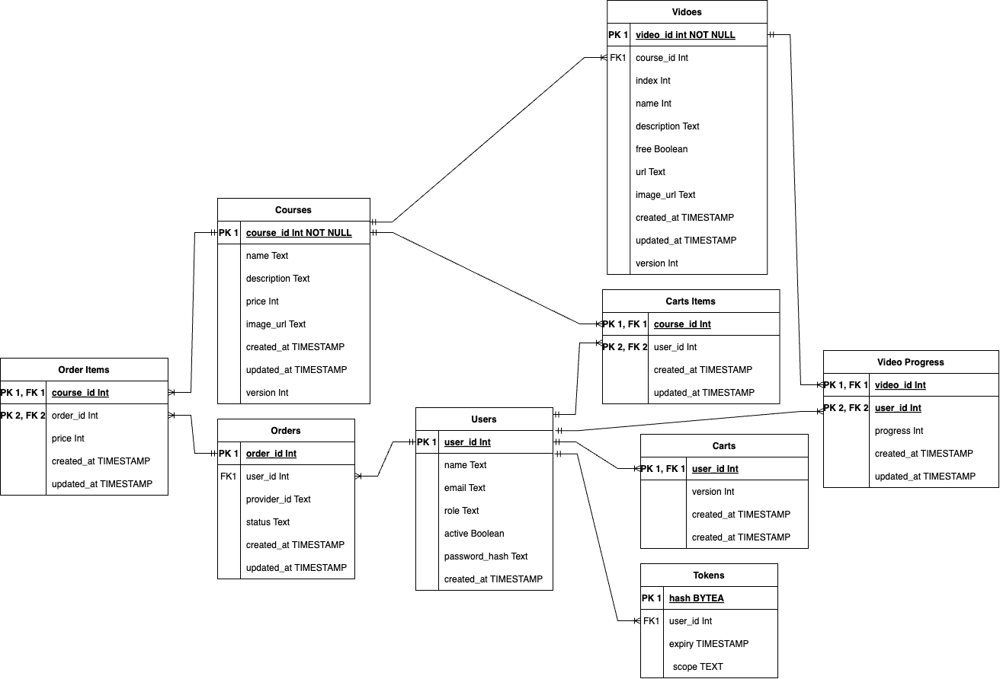

<h1 align="center">Ecommerce</h1>
<p align="center"><i><b>A simple web platform to sell videos on demand.</b></i></p>
<hr>

## Features

- Login with google or password.
- Require email activation.
- Password reset.
- Free samples.
- Shopping cart.
- Purchase with stripe or paypal.
- Play videos through [VideoJS](https://github.com/videojs) (support all major streaming formats).
- Store video progress.

## Configuration

Backend: These are some environment variables you might need to set. You can find them
all in the [configuration
package](https://github.com/polldo/govod/blob/main/config/config.go).

```bash
# Web configuration.
export GOVOD_WEB_ADDRESS="127.0.0.1:8000"
export GOVOD_AUTH_ACTIVATION_REQUIRED=true
# Database configuration.
export GOVOD_DB_USER="postgres"
export GOVOD_DB_NAME="govod"
# SMTP configuration.
export GOVOD_EMAIL_HOST=""
export GOVOD_EMAIL_PORT=""
export GOVOD_EMAIL_ADDRESS=""
export GOVOD_EMAIL_PASSWORD=""
# Paypal configuration.
export GOVOD_PAYPAL_CLIENT_ID=""
export GOVOD_PAYPAL_SECRET=""
# Stripe configuration.
export GOVOD_STRIPE_API_SECRET=""
export GOVOD_STRIPE_WEBHOOK_SECRET=""
# Google oauth configuration.
export GOVOD_OAUTH_GOOGLE_CLIENT=""
export GOVOD_OAUTH_GOOGLE_SECRET=""
export GOVOD_OAUTH_GOOGLE_URL=""
export GOVOD_OAUTH_GOOGLE_REDIRECT_URL=""
export GOVOD_OAUTH_LOGIN_REDIRECT_URL=""
# CORS configuration.
export GOVOD_CORS_ORIGIN="http://mylocal.com:3000"
```

Frontend: set these env vars in a `frontend/.env.local` file:

```bash
NEXT_PUBLIC_PAYPAL_CLIENT_ID=""
NEXT_PUBLIC_BASE_URL="http://mylocal.com:8000"
```

## Database Schema



## Build and run

This project uses PostgreSQL, so you need it to run the backend.

You'll also need to run the [db migrations](https://github.com/irsalhamdi/e-commerce-video/tree/main/database/sql/migration).

Then, to correctly integrate stripe and paypal, you need to make an account and
fill the environment variables accordingly.

For the SMTP server you can use a dedicated service like Mailtrap.

To run the backend - assuming your env variables are defined in a .env file:

```bash
cd cmd/server
. ./.env
go run .
```

To run the frontend:

```bash
cd frontend
npm run dev
```
